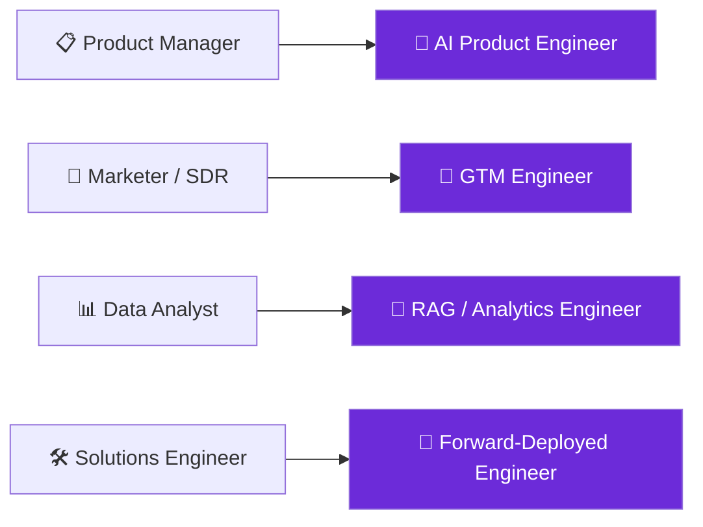

# Awesome AI-Native Jobs 

**A curated map of the new generation of AI-native jobs** — the roles, real salaries, skills, interview prep, and projects to land them.

*Maintained by [Landed](https://landed.b100x.ai) — scout AI-native roles, get **referred**, prep with mock interviews, and land the job.*

---

The job market is being rewritten. "Product Manager" is becoming **AI Product Engineer**. "Marketer" is becoming **GTM Engineer**. Whole new titles — **Forward-Deployed Engineer, RAG Engineer, Context Engineer** — barely existed two years ago, and roles needing AI skills now carry a **~56% wage premium**. This repo maps that shift and gives you everything to break in.

> ⭐ **Star this repo** — it's the umbrella for a whole set of curated job lists, interview guides, and roadmaps, refreshed regularly.

## Contents

- [The new AI-native roles](#the-new-ai-native-roles) (with real salaries + skills)
- [Live job lists](#live-job-lists)
- [Interview prep](#interview-prep)
- [Projects to build](#projects-to-build)
- [Roadmaps](#roadmaps)
- [The data](#the-data)
- [FAQ](#faq)
- [Contributing](#contributing)

---

## The new AI-native roles

> Comp = approximate 2026 ranges (base, US unless noted; India where relevant), aggregated from public salary reports. Total comp runs higher with equity, especially at frontier labs.

### 🤖 AI Engineer
Builds products on top of LLMs — RAG, agents, evals, inference. Most roles want shipping ability, **not** an ML PhD.
- **Skills:** Python, LLM APIs, RAG, agents/tool-use, evals, vector DBs, some TypeScript.
- **Comp:** US base **$145K–$310K** (senior SF/NY $400K+ TC). India **₹12–18L** entry → **₹55L–₹1.1Cr** senior at top product cos.
- **Hiring:** frontier labs, applied-AI startups, enterprise AI teams. → [job list](https://github.com/landedjobs/2026-ai-engineer-jobs)

### 🤝 Forward-Deployed Engineer (FDE)
Customer-embedded builder — part engineer, part consultant, shipping custom solutions on the company's platform.
- **Skills:** Python, integrations, solutions design, customer-facing communication, data.
- **Comp:** base **$175K–$260K**, OTE **$230K–$360K**; median TC mid-level ~**$385K**, staff ~**$610K**, principal **$1.2M+** at frontier labs.
- **Hiring:** Palantir, OpenAI, Anthropic, applied-AI startups. → [job list](https://github.com/landedjobs/forward-deployed-engineer-jobs)

### 🚀 GTM Engineer
Automates go-to-market with code + AI — outbound, enrichment, lead scoring, revenue workflows. The technical evolution of the marketer/SDR.
- **Skills:** Clay + enrichment, APIs/webhooks, SQL, LLM-personalized outbound, CRM data.
- **Comp:** base **$180K–$240K**, OTE **$230K–$310K** (25–30% variable); broader range **$132K–$241K**.
- **Hiring:** Clay, Vapi, fast-growing B2B SaaS. → [job list](https://github.com/landedjobs/gtm-engineer-roles)

### 🔎 RAG Engineer
Connects LLMs to trusted data so answers are accurate and grounded — retrieval pipelines, embeddings, re-ranking, evals. ~10–20% premium over general AI engineering.
- **Skills:** vector DBs (Pinecone/Weaviate/pgvector/Chroma), chunking, hybrid search + BM25, re-ranking, retrieval evals (recall@k, MRR, nDCG), caching/cost, MLOps.
- **Comp:** US entry **$120K–$160K**, mid **$160K–$220K**, senior **$200K–$280K+**. India mid **₹4–20L**, senior **₹20–58L+**.
- **Hiring:** every company with an AI feature that must be *right*. → [interview prep](https://github.com/landedjobs/rag-engineer-interview-questions)

### 🧩 AI Product Engineer
The new "PM who ships" — owns product *and* builds the AI features. Prompts, evals, and prototyping matter as much as roadmaps.
- **Skills:** product sense, prompting, evals, rapid prototyping, React/Next.js, APIs.
- **Comp:** roughly **$150K–$300K** US depending on the AI-eng/PM blend.
- **Hiring:** product-led startups (Linear, Vercel, Cursor). → [job list](https://github.com/landedjobs/ai-product-engineer-new-grad) · [roadmap](https://github.com/landedjobs/ai-product-engineer-roadmap)

---

## Live job lists

Auto-updated, open job lists per role:

- 🤖 [2026 AI Engineer Jobs](https://github.com/landedjobs/2026-ai-engineer-jobs)
- 🚀 [GTM Engineer Roles](https://github.com/landedjobs/gtm-engineer-roles)
- 🧩 [AI Product Engineer — New Grad](https://github.com/landedjobs/ai-product-engineer-new-grad)
- 🤝 [Forward-Deployed Engineer Jobs](https://github.com/landedjobs/forward-deployed-engineer-jobs)

> **See every AI-native role + referral intros + application tracking on [Landed →](https://landed.b100x.ai)**

## Interview prep

- 🧠 [Awesome AI Engineer Interview](https://github.com/landedjobs/awesome-ai-engineer-interview)
- 🔎 [RAG Engineer Interview Questions](https://github.com/landedjobs/rag-engineer-interview-questions)
- 📦 [AI PM Interview Prep](https://github.com/landedjobs/ai-pm-interview-prep)

## Projects to build

- 🧪 [Projects to Land an AI Job](https://github.com/landedjobs/projects-to-land-an-ai-job)
- 🏗️ [AI Engineer Portfolio Projects](https://github.com/landedjobs/ai-engineer-portfolio-projects)

## Roadmaps

- 🗺️ [AI Product Engineer Roadmap](https://github.com/landedjobs/ai-product-engineer-roadmap)
- 📈 [Become a GTM Engineer](https://github.com/landedjobs/become-a-gtm-engineer)

---

## The data

- **AI Engineer** was a **#1 fastest-growing** US job title; postings up **~143% YoY**.
- AI/ML job postings rose **~163%** from 2024 → 2025.
- Roles requiring AI skills carry a **~56% wage premium** (up from ~25% a year earlier).
- Forward-Deployed comp can swing **4–5×** across frontier labs vs enterprise AI teams.

> Skills that show up most across these roles: **Python · LLM APIs · RAG · agents/tool-use · evals · vector DBs · prompting · rapid prototyping**. Bonus: TypeScript/Next.js, cloud, observability.

---

## FAQ

**Do I need an ML PhD to get an AI-native job?**
No. Most AI Engineer / AI Product Engineer roles want people who can **ship** with LLMs and APIs (RAG, agents, evals) — not researchers. Demonstrated projects beat credentials.

**What's the fastest way to stand out?**
Build 2–3 real projects (see [projects](https://github.com/landedjobs/projects-to-land-an-ai-job)) and get **referred** instead of applying cold — referrals convert far better than the application pile.

**Are these roles remote / available in India?**
Yes — the job lists include US, remote, and India-based roles, with India comp noted above.

---

## Contributing

PRs and issues welcome — add roles, questions, projects, or resources. See [CONTRIBUTING.md](CONTRIBUTING.md). This is a community map of a fast-moving market; help keep it current.

---

### Don't just apply. Get **referred**, get **prepped**, get **Landed**.

Maintained by [Landed](https://landed.b100x.ai) · Comp figures aggregated from public 2026 salary reports; ranges are approximate.

