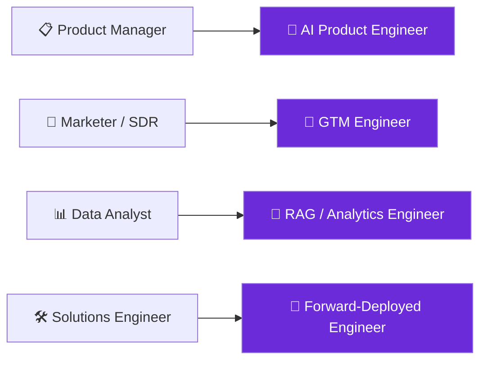

**A curated map of the new generation of AI-native jobs:** the roles, skills, interview prep, and projects to land them.

*Maintained by [landed](https://go.landed.jobs/1f9t00o): daily job matches, application drafts with Enzo, and mock-interview prep.*

---

The job market is being rewritten. "Product Manager" is becoming **AI Product Engineer**. "Marketer" is becoming **GTM Engineer**. Titles such as **Forward-Deployed Engineer, RAG Engineer, and Context Engineer** now have distinct hiring tracks, tools, and evidence expectations. This repo maps that shift and gives you practical ways to break in.

> ⭐ **Star this repo.** It's the umbrella for 18 live job lists, interview guides, and roadmaps. The job lists refresh every 2 days.

```mermaid
flowchart LR
    PM["📋 Product Manager"] --> APE["🤖 AI Product Engineer"]
    MKT["📣 Marketer / SDR"] --> GTM["🚀 GTM Engineer"]
    DA["📊 Data Analyst"] --> RAG["🔎 RAG / Analytics Engineer"]
    SE["🛠️ Solutions Engineer"] --> FDE["🤝 Forward-Deployed Engineer"]
    style APE fill:#6C2BD9,color:#fff
    style GTM fill:#6C2BD9,color:#fff
    style RAG fill:#6C2BD9,color:#fff
    style FDE fill:#6C2BD9,color:#fff
```

## Contents

- [The new AI-native roles](#the-new-ai-native-roles) (skills and who is hiring)
- [The full family](#the-full-family): every repo we maintain, with live job counts
- [The data](#the-data)
- [FAQ](#faq)
- [Contributing](#contributing)

---

## The new AI-native roles

> Compensation changes quickly by level, geography, stage, and cash/equity mix. Use the linked live job lists and current employer disclosures for role-specific ranges; this umbrella does not claim one market-wide benchmark.

### 🤖 AI Engineer
Builds products on top of LLMs: RAG, agents, evals, inference. Most roles want shipping ability, **not** an ML PhD.
- **Skills:** Python, LLM APIs, RAG, agents/tool-use, evals, vector DBs, some TypeScript.
- **Comp:** varies widely by level, geography, model depth, and whether the role owns production systems; verify against current disclosed postings.
- **Hiring:** frontier labs, applied-AI startups, enterprise AI teams. → [job list](https://github.com/landedjobs/ai-engineer-jobs)

### 🤝 Forward-Deployed Engineer (FDE)
Customer-embedded builder, part engineer and part consultant, shipping custom solutions on the company's platform.
- **Skills:** Python, integrations, solutions design, customer-facing communication, data.
- **Comp:** compare like-for-like roles carefully because field engineering, solutions work, travel, sales incentives, and frontier-lab leveling create very different packages.
- **Hiring:** Palantir, OpenAI, Anthropic, applied-AI startups. → [job list](https://github.com/landedjobs/forward-deployed-engineer-jobs)

### 🚀 GTM Engineer
Automates go-to-market with code + AI: outbound, enrichment, lead scoring, revenue workflows. The technical evolution of the marketer/SDR.
- **Skills:** Clay + enrichment, APIs/webhooks, SQL, LLM-personalized outbound, CRM data.
- **Comp:** establish whether the package is salary-only or includes variable compensation, then compare the same geography, stage, and ownership level.
- **Hiring:** Clay, Vapi, fast-growing B2B SaaS. → [job list](https://github.com/landedjobs/gtm-engineer-jobs)

### 🔎 RAG Engineer
Connects LLMs to trusted data so answers are accurate and grounded: retrieval pipelines, embeddings, re-ranking, and evals.
- **Skills:** vector DBs (Pinecone/Weaviate/pgvector/Chroma), chunking, hybrid search + BM25, re-ranking, retrieval evals (recall@k, MRR, nDCG), caching/cost, MLOps.
- **Comp:** benchmark against current AI/ML engineering roles with comparable retrieval ownership and production scope.
- **Hiring:** every company with an AI feature that must be *right*. → [interview prep](https://github.com/landedjobs/rag-engineer-interview-questions)

### 🧩 AI Product Engineer
The engineer who owns product *and* builds the AI features. Prompts, evals, and prototyping matter as much as roadmaps.
- **Skills:** product sense, prompting, evals, rapid prototyping, React/Next.js, APIs.
- **Comp:** benchmark the actual engineering/product blend, level, and geography; the title alone is not a reliable compensation band.
- **Hiring:** product-led startups (Linear, Vercel, Cursor). → [job list](https://github.com/landedjobs/software-engineer-jobs) · [roadmap](https://github.com/landedjobs/ai-product-engineer-roadmap)

---

## The full family

> Every open-source repo we maintain: live job lists, opportunities, interview prep, roadmaps, and tools. **[Get fresh AI-native roles matched to you daily on Landed →](https://go.landed.jobs/1f9t00o)**

<!-- FAMILY:START -->

<!-- JOB-LISTS:START (generated by workers/github-repos, do not edit by hand) -->

### 🔴 Live job lists, refreshed every 2 days (last refresh 2026-09-28)

Global roles, with US-based and worldwide-remote roles listed first. Each list shows up to 300 of the newest open postings.

| List | What it covers | Roles listed |
|---|---|--:|
| 🤖 [AI Engineer](https://github.com/landedjobs/ai-engineer-jobs) | build products on top of LLMs: RAG, agents, evals, inference | 300 |
| 🧠 [LLM Engineer](https://github.com/landedjobs/llm-engineer-jobs) | fine-tuning, inference, and LLM product engineering | 288 |
| 🕹️ [AI Agent Engineer](https://github.com/landedjobs/ai-agent-engineer-jobs) | planning, tool use, orchestration, guardrails | 300 |
| 🔬 [Applied Scientist / Research Engineer](https://github.com/landedjobs/applied-scientist-and-research-engineer-jobs) | applied research, training, evaluation | 300 |
| 🤝 [Forward-Deployed Engineer](https://github.com/landedjobs/forward-deployed-engineer-jobs) | customer-embedded builder, part engineer, part consultant | 300 |
| 🛠️ [Solutions Engineer / Architect](https://github.com/landedjobs/solutions-engineer-and-architect-jobs) | technical pre-sales, integrations, deployment | 300 |
| 🛢️ [Data Engineer](https://github.com/landedjobs/data-engineer-jobs) | pipelines and platforms that power AI | 300 |
| 📊 [Data Scientist](https://github.com/landedjobs/data-scientist-jobs) | analytics, experimentation, machine learning | 300 |
| 🦾 [Robotics & Embedded](https://github.com/landedjobs/ai-robotics-and-embedded-jobs) | perception, control, embedded ML | 300 |
| 🧩 [Product Engineer](https://github.com/landedjobs/ai-product-engineer-jobs) | engineers who build and ship product features | 300 |
| 🚀 [GTM Engineer](https://github.com/landedjobs/gtm-engineer-jobs) | automate go-to-market with code and AI | 110 |
| 💼 [Freelance & Advisory](https://github.com/landedjobs/ai-freelance-and-advisory-jobs) | fractional, contract, and advisory roles | 300 |

[Get roles like these matched to you on landed →](https://go.landed.jobs/1f9t00o)

<!-- JOB-LISTS:END -->

### 🎯 More ways in: opportunities beyond the job boards

- 🔥 [Who's Hiring in AI](https://github.com/landedjobs/whos-hiring-in-ai): real hiring posts from founders on X, sorted by role
- 💸 [Recently-Funded AI Startups](https://github.com/landedjobs/recently-funded-ai-startups-hiring): fresh-capital startups staffing up now
- 🎓 [AI Fellowships & Residencies](https://github.com/landedjobs/ai-fellowships-and-residencies): 75 fellowships, residencies & programs with stipends and deadlines

### 🧠 Interview prep

- 📘 [AI Interview Guides](https://github.com/landedjobs/ai-interview-guides): 33 company-by-company guides: process, questions, comp
- ❓ [AI Interview Questions](https://github.com/landedjobs/ai-interview-questions): 331 real questions with sources and ideal answers
- 🧠 [Awesome AI Engineer Interview](https://github.com/landedjobs/awesome-ai-engineer-interview): questions, worked system designs, company guides
- 🔎 [RAG Engineer Interview Questions](https://github.com/landedjobs/rag-engineer-interview-questions): RAG and retrieval interview questions
- 📦 [AI PM Interview Prep](https://github.com/landedjobs/ai-pm-interview-prep): product sense, AI fluency, frameworks, real questions

### 🏗️ Build & learn

- 🧭 [AI Job Hunt OS](https://github.com/landedjobs/ai-job-hunt-os): six source-conscious agent skills for the full job-search loop
- 🧪 [Projects to Land an AI Job](https://github.com/landedjobs/projects-to-land-an-ai-job): deep, buildable briefs with evals and a deploy path
- 📦 [AI Engineer Portfolio Projects](https://github.com/landedjobs/ai-engineer-portfolio-projects): 85+ buildable projects by theme
- 🗺️ [AI Product Engineer Roadmap](https://github.com/landedjobs/ai-product-engineer-roadmap): skills, tools, milestones for the role
- 🎯 [Become a GTM Engineer](https://github.com/landedjobs/become-a-gtm-engineer): the technical go-to-market roadmap

### 🧰 Tools

- 🧰 [Landed MCP Server](https://github.com/landedjobs/landed-mcp): search jobs, prep applications, and study from any MCP client

<!-- FAMILY:END -->

---

## How to read the map

This is a navigation layer, not a labor-market census. Each job list covers a selected role family and
changes as the underlying postings change. Use it to discover titles, skills, and openings; use live
employer disclosures and clearly defined external datasets for market-wide claims.

> Common skill clusters across these role families include **Python · LLM APIs · RAG · agents/tool-use · evals · vector DBs · prompting · rapid prototyping**. The relevant cluster depends on the actual role.

---

## FAQ

**Do I need an ML PhD to get an AI-native job?**
No. Most AI Engineer / AI Product Engineer roles want people who can **ship** with LLMs and APIs (RAG, agents, evals), not researchers. Demonstrated projects beat credentials.

**What's the fastest way to stand out?**
Build 2–3 real projects (see [projects](https://github.com/landedjobs/projects-to-land-an-ai-job)) and get **referred** instead of applying cold. A referral usually gets more attention than a cold application.

**Are these roles remote / available in India?**
Yes. The job lists are global. US-based and worldwide-remote roles are listed first, and each row shows any country, region, or time-zone limits.

---

## Contributing

PRs and issues welcome: add roles, questions, projects, or resources. See [CONTRIBUTING.md](CONTRIBUTING.md). This is a community map of a fast-moving market; help keep it current.

---

### Stop spraying. Get **matched**, get **prepped**, get **Landed**.

Maintained by [Landed](https://go.landed.jobs/1f9t00o) · Market-wide claims require a dated, defined external source.

